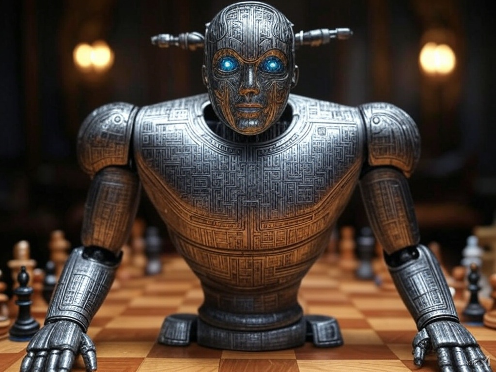
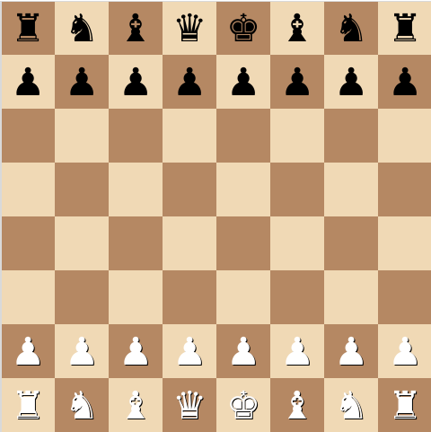

# Train
```sh
python3 train.py --fresh
```

# Eval
```sh
python3 eval.py
```

# GUI
to play against the agent run 
> but make sure that you have already trained the agent and the agent's weights are in the same directory

```sh
python3 gui.py
```

# Data
games.csv is 10,000 games downloaded from https://www.kaggle.com/datasets/datasnaek/chess?resource=download

# License
MIT